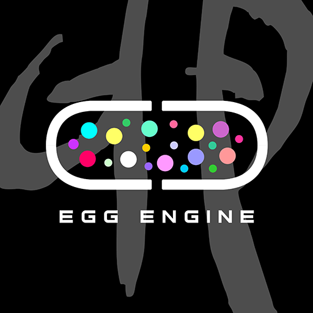

# 概述

egg 并不是什么缩写。中文意思就是"卵"。

这是个游戏引擎，或者说是个交互图形引擎。从2012年左右开始，各种修改和推倒重来。最初的目的仅仅是为了在安卓上开发GLES更方便点。

不过现在的定位是两个：egg核心作为一个简单的c++基础功能库，第二是轻量级完整的移动引擎。

# 模块文档

[egg核心模块](doc/egg.md)

[虚拟文件系统](doc/vfs.md)

[资源管理模块](doc/asset.md)

# 路线图

### 第一阶段

1. 整理和重构egg核心，补充单元测试。
2. 整理和重构eggEngine部分，补充单元测试和Qt测试界面。

### 第二阶段

1. 重新考虑editor和app模块的去留问题。可能回提升到avalon项目中。

   